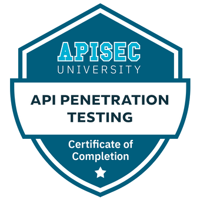

## Contributions to projects :

| Repository | Topic  | Pull Request  |
|---|---|---|
| [swisskyrepo/PayloadsAllTheThings](https://github.com/swisskyrepo/PayloadsAllTheThings/) | SQL Injection  | [Update the PostgreSQL Time Based Payloads for Database,Table,Columns Extract](https://github.com/swisskyrepo/PayloadsAllTheThings/pull/537) |  
| [swisskyrepo/PayloadsAllTheThings](https://github.com/swisskyrepo/PayloadsAllTheThings/) | HTTP Request Smuggling | [Add my tool for manually HTTP Request Smuggling exploitation](https://github.com/swisskyrepo/PayloadsAllTheThings/pull/539) | 

## Research
* [HTTP3ONSTEROIDS -  CVE 2023 25950 Proof of concept](https://github.com/dhmosfunk/HTTP3ONSTEROIDS)
* [CVE 2023 25690 Proof of concept](https://github.com/dhmosfunk/CVE-2023-25690-POC)

## Certifications

